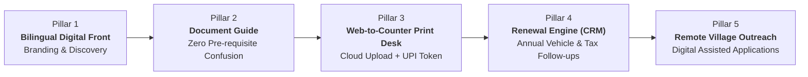
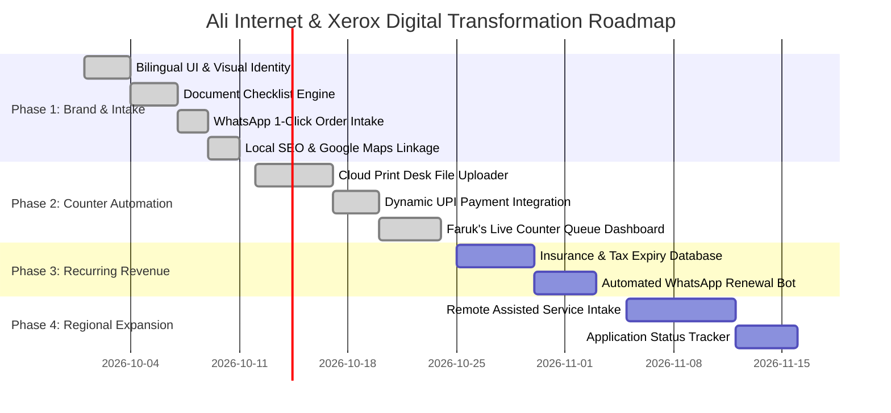

# Project Charter & Founding Document: Ali Internet & Xerox
**Digital Transformation & Growth Blueprint**  
**আলি ইন্টারনেট এন্ড জেরক্স — ডিজিটাল রূপান্তর ও ব্যবসায়িক উন্নয়ন পরিকল্পনা**

---

## 1. Executive Summary & Vision Statement

### 1.1 The Vision
Transform **Ali Internet & Xerox (আলি ইন্টারনেট এন্ড জেরক্স)** from a conventional, foot-traffic-dependent village xerox and online kiosk into a **high-efficiency, tech-enabled Rural Digital Services & Citizen Hub** serving Puncha and surrounding gram panchayats in Purulia district.

### 1.2 The Partnership Model
* **Business & Counter Operator:** **সেখ ফারুক আলি (Sekh Faruk Ali)**
  * *Strengths:* Ground presence, established local trust, deep knowledge of regional documentation needs, customer relationships, physical execution.
* **Technology & Systems Partner:** **Software Engineer / Systems Architect (You)**
  * *Strengths:* System design, cloud infrastructure, automation pipelines, UX design, data management, SEO/digital acquisition.

By combining physical community trust with modern digital infrastructure, the business will unlock scalable recurring revenue (insurance/tax renewals), eliminate counter crowding, expand geographic reach to remote villages, and create a frictionless customer experience.

---

## 2. Business Profile & Entity Details

| Attribute | Details |
| :--- | :--- |
| **Business Name (Bengali)** | **আলি ইন্টারনেট এন্ড জেরক্স** |
| **Business Name (English)** | **Ali Internet & Xerox** |
| **Specialized Desk** | **আলি ইন্স্যুরেন্স পয়েন্ট (Ali Insurance Point)** |
| **Proprietor** | সেখ ফারুক আলি (Sekh Faruk Ali) |
| **Primary Contact** | `+91 9734573323` |
| **Official Email** | `allinternetpuncha@gmail.com` / `aliinternetpuncha@gmail.com` |
| **Physical Address** | পুঞ্চা (কৃষি ফার্মের বিপরীতে), পুঞ্চা, পুরুলিয়া, পশ্চিমবঙ্গ — ৭২৩১৫১ <br> *(Puncha, Opposite Krishi Farm, Puncha, Purulia, West Bengal — 723151)* |
| **GPS Coordinates** | `23.165622° N, 86.655718° E` (Plus Code: `5M84+67J, Puncha`) |
| **Target Demographic** | Farmers, vehicle owners, students, job aspirants, small business owners, and rural citizens of Puncha block & adjoining areas. |

---

## 3. Comprehensive Service Portfolio

The business operates across four distinct commercial verticals:

```mermaid
graph TD
    A["আলি ইন্টারনেট এন্ড জেরক্স (Ali Internet & Xerox)"] --> B["1. Citizen & E-Governance Services"]
    A --> C["2. Parivahan & Vehicle Desk"]
    A --> D["3. Document Production & Finishing"]
    A --> E["4. Student & Retail Kiosk"]

    B --> B1["PAN Card (New / Correction)"]
    B --> B2["Voter ID (Form 6, 8, Shifting)"]
    B --> B3["Ration Card (Digital / Aadhaar Link)"]
    B --> B4["Jamir Porcha (Land Records / Banglarbhumi)"]
    B --> B5["Trade License & Food License (FSSAI)"]
    B --> B6["MSME / Udyam Registration & P-Tax"]
    B --> B7["Job & University Exam Form Fill-up"]

    C --> C1["Two-Wheeler & Four-Wheeler Insurance"]
    C --> C2["Commercial Vehicle Tax & Fitness"]
    C --> C3["Driving License & Learner License (Sarathi)"]

    D --> D1["B&W & High-Speed Color Xerox"]
    D --> D2["Instant Passport & Digital Photo Print"]
    D --> D3["Document Lamination & Spiral Binding"]
    D --> D4["Custom Rubber Stamp Manufacturing"]

    E --> E1["Mobile Accessories (Chargers, Cables, Earphones)"]
    E --> E2["School & College Stationery"]
    E --> E3["Packaged Drinking Water"]
```



---

## 4. Problem Statement & Market Opportunity

### 4.1 Shop Owner (Faruk's) Operational Pain Points
1. **The "Document Deficit" Delay:** Customers wait in line only to discover they forgot their Aadhaar-linked phone, family head voter card, or land deed. This wastes counter time and creates queue backlogs.
2. **Repetitive Inquiries (50+ calls/day):** Answering identical questions on phone or in-person (*"What documents are needed for DL?"*, *"Has my PAN card arrived?"*, *"Is my Ration card verified?"*).
3. **Peak Hour Bottlenecks:** During exam deadlines or scheme announcements, 15+ customers crowd the shop, leading to walkaways and lost sales.
4. **Zero Renewal Retention:** Vehicle insurance, commercial vehicle road tax, and trade licenses expire annually. Faruk currently has no automated CRM to notify past clients before their policies expire, losing high-margin renewal commissions to competitors.

### 4.2 Customer Pain Points
1. **Unnecessary Travel & Travel Expense:** Villagers from 5–15 km away spend ₹50–₹100 on transit to reach Puncha just to submit simple paperwork.
2. **Uncertainty & Queues:** Waiting 45 minutes to get 3 pages printed or verify application status.
3. **Language & Interface Barrier:** Government portals are predominantly in complex English/bureaucratic terms; citizens need clear, simple guidance in Bengali.

---

## 5. Strategic Growth Pillars (The Tech Advantage)



### Pillar 1: High-Performance Bilingual Web Presence
* Fully responsive, mobile-first web app available in **Bengali (বাংলা)** and **English**.
* High local SEO optimization for Puncha, Manbazar, Hura, and Purulia search queries.
* 1-tap WhatsApp connectivity, direct calling, and precise Google Map navigation (opposite Krishi Farm).

### Pillar 2: Interactive Document Requirements Guide (ডকুমেন্ট গাইড)
* Self-service checklist where a customer clicks a service (e.g., *New Ration Card*, *Driving License*, *Land Porcha*, *Food License*).
* Instantly displays the exact required documents, photo specifications, fee structure, and processing time before they leave home.

### Pillar 3: Web-to-Counter Print Desk ("Skip The Line")
* Customers upload PDF/DOC/Images directly from their mobile browser.
* Select specifications: B&W vs. Color, number of copies, single/both sides, lamination.
* Upfront automated price calculation + dynamic UPI QR payment or "Pay at Counter".
* Generates an Order Token (e.g., `#P-204`). Faruk's shop PC shows incoming print jobs ready to be dispatched with 1 click.

### Pillar 4: The Cash Engine — Proactive Renewal & Expiry CRM
* Managed database tracking:
  * Two-Wheeler / Four-Wheeler Insurance Expiry Dates
  * Commercial Vehicle Road Tax & Fitness Deadlines
  * Trade License & Food Safety Renewal Dates
* Automated WhatsApp/SMS alerts triggered 15 days and 3 days before expiry with direct renewal links.
* **Economic Impact:** Converts one-time walk-ins into guaranteed lifetime recurring income.

### Pillar 5: Remote Digital CSC Desk (Assisted Applications)
* Secure document upload portal for citizens residing in surrounding villages.
* Faruk processes applications on official government portals (`Banglarbhumi`, `Parivahan`, `WBPDS`, etc.) and delivers digital acknowledgments back to the user's dashboard or WhatsApp.

---

## 6. Technical Architecture & System Design

```
┌────────────────────────────────────────────────────────┐
│                   CLIENT LAYER (PWA)                   │
│   • Mobile-First Responsive Web (Bengali / English)    │
│   • Document Requirement Finder                        │
│   • Web Print Upload + Dynamic UPI QR Generator        │
│   • Application Status Tracking Interface              │
└──────────────────────────┬─────────────────────────────┘
                           │ HTTPS / WebSockets
┌──────────────────────────▼─────────────────────────────┐
│                 APPLICATION & API LAYER                │
│   • Static Edge Delivery (Vercel / Cloudflare)         │
│   • Serverless API Handlers (Orders, Tracking, Leads)  │
│   • Webhook Gateways (WhatsApp Cloud API / Twilio)     │
└──────────────────────────┬─────────────────────────────┘
                           │
┌──────────────────────────▼─────────────────────────────┐
│               DATA & STORAGE LAYER (Supabase)          │
│   • Relational DB: Customers, Policies, Expiry Dates   │
│   • Object Storage: Encrypted Customer Docs & Prints   │
│   • Realtime Engine: Live Order Queue for Faruk's PC   │
└──────────────────────────┬─────────────────────────────┘
                           │
             ┌─────────────┴─────────────┐
             ▼                           ▼
┌───────────────────────────┐ ┌───────────────────────────┐
│   FARUK'S COUNTER DESK    │ │    TECH PARTNER CONSOLE   │
│ • Big-button Bengali UI   │ │ • DB Migrations & Schema  │
│ • Live Audio/Visual Chime │ │ • Automated Cron Engine   │
│ • 1-Click Print & Token   │ │ • Analytics & Backups     │
└───────────────────────────┘ └───────────────────────────┘
```

### Technology Stack Recommendations
* **Frontend:** Modern Web Application (HTML5 / Vanilla CSS with modern tokens / Vanilla JS or lightweight React/Vite/Next.js) for instantaneous load times on low-bandwidth 4G mobile networks.
* **Database & Auth:** Supabase (PostgreSQL with Row Level Security, Realtime subscriptions, and S3-compatible file storage).
* **Payments:** Direct Bharat UPI Deep-linking & Dynamic QR code rendering (zero transaction fee overhead for the shop).
* **Messaging & Alerts:** WhatsApp Business Cloud API / Automated Webhook Triggers for status notifications and renewal reminders.
* **Hosting:** Edge CDN (Free tier on Vercel / Cloudflare Pages / Netlify) ensuring ₹0 ongoing server cost.

---

## 7. Phased Implementation Roadmap



### Phase Breakdown

#### Phase 1: Brand Foundation, Bilingual Showcase & Lead Engine (Immediate)
* Public-facing storefront with rich Bengali typography and high-contrast, professional visual aesthetic.
* Complete catalog of all 18+ services divided into intuitive categories.
* Interactive "Check Required Documents" (ডকুমেন্ট চেকলিস্ট) tool.
* 1-Click WhatsApp Order Builder with structured query templates.
* Local Google Maps integration for exact driving directions opposite Krishi Farm.

#### Phase 2: Web-to-Counter Print Desk & UPI Integration
* Direct document/photo uploader with client-side thumbnail preview.
* Copy count, color/B&W, paper size, and finishing options with real-time bill calculation.
* QR code generation for PhonePe, Google Pay, Paytm, or "Pay on Delivery at Shop".
* Single-screen Counter View for Faruk's shop PC with live audio chime on new orders.

#### Phase 3: The Renewal Engine (Automated Insurance & Tax CRM)
* Customer ledger storing: Name, Phone, Vehicle Number, Policy Number, Expiry Date.
* Scheduled background worker sending automated reminder alerts 15 days, 7 days, and 1 day prior to expiration.
* Dedicated landing page for instant policy renewal quotes.

#### Phase 4: Remote Citizen Portal & Application Tracker
* Guided multi-step forms for remote residents to apply for Ration Card additions, Voter ID updates, Land Porcha, and Trade Licenses.
* Tracking module: Customers input reference number or phone to check whether their application is Submitted, In Review, or Ready for pickup.

---

## 8. Division of Responsibilities & Operations

| Task / Domain | Sekh Faruk Ali (Shop Counter) | Tech Partner (You) |
| :--- | :---: | :---: |
| **Physical Printing & Lamination** | Lead | — |
| **Direct Cash Collection & Counter UPI** | Lead | — |
| **Govt Portal Submissions (Banglarbhumi, Sarathi)** | Lead | Setup guides / templates |
| **Customer Physical Document Verification** | Lead | — |
| **System Uptime & Hosting Management** | — | Lead |
| **Frontend/Backend Code Maintenance** | — | Lead |
| **Database Architecture & Data Security** | — | Lead |
| **Automated WhatsApp Renewal Pipeline** | Provides expiry logs | Builds & monitors bot |
| **Local Google Business Profile & SEO** | Verifies SMS/Call code | Configures listing & assets |

---

## 9. Data Privacy, Legal Compliance & Security Safeguards

1. **Aadhaar Data Protection:** The system will **never** store Aadhaar OTPs or raw biometric data. Masked Aadhaar guidelines will be strictly adhered to.
2. **Ephemeral Document Storage:** Uploaded print files (PDFs/photos) sent through the web print queue will auto-purge from cloud storage after 48 hours to protect customer confidentiality and minimize storage overhead.
3. **Encrypted Database:** Customer contact numbers and vehicle policy records will reside in an encrypted PostgreSQL instance with authenticated access restricted to Faruk and the technical administrator.

---

## 10. Key Performance Indicators (Success Metrics)

* **Counter Efficiency:** Reduce average customer wait time during peak hours from 25 minutes to under 5 minutes.
* **Elimination of Wasted Trips:** Achieve 90%+ first-visit document completeness through the online Document Guide.
* **Insurance Renewal Retention Rate:** Reach an 80%+ renewal rate for vehicle insurance policies processed through the shop.
* **Footprint Expansion:** Generate at least 25% of new monthly citizen service applications from outside Puncha proper (remote village users).

---

*Document approved for engineering implementation.*  
*Authored on September 29, 2026.*
